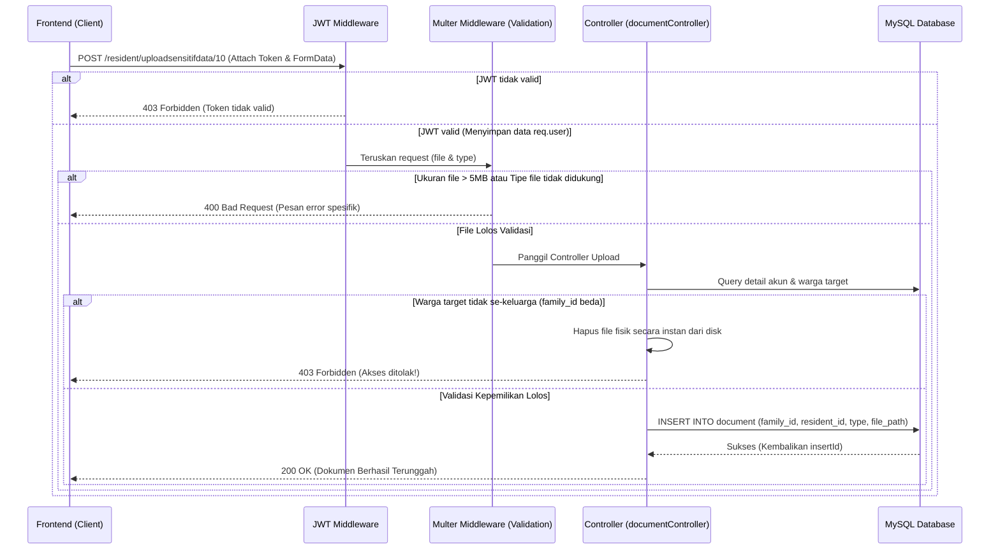

# 📁 Bab 6: Fitur Upload & Download Dokumen Sensitif (Multer & JWT Protection)

Bab ini memuat panduan lengkap tentang fitur unggah (upload) dan unduh (download) berkas dokumen warga yang aman (tidak terekspos secara statis ke publik) menggunakan otorisasi JWT.

---

## 📁 Fitur Upload & Download Dokumen Sensitif (Multer & JWT Protection)

> [!IMPORTANT]
> ⚠️ **DESAIN ARSITEKTUR & KEAMANAN DATA SENSITIF (WAJIB DIPAHAMI FRONTEND SEBELUM DEPLOY!)** ⚠️
>
> 🚀 **Mengapa Harus Didesain Seperti Ini?**
>
> * **Zero Public Exposure (Tidak Bocor)**: Kita menaruh folder penyimpanan file (`secure_uploads/`) di root project, yang berada **di luar folder statis publik Express**. File-file di sini tidak terindeks oleh mesin pencari (SEO) dan tidak bisa diakses langsung via URL statis browser (misalnya: `http://localhost:3333/secure_uploads/ktp.png` akan menghasilkan `404 Not Found`).
> * **Tabel Database `document` yang Terpisah**: Berbeda dengan implementasi malas di mana file disimpan sebagai string kolom di dalam tabel `warga`, kita menggunakan tabel tersendiri (`document`) dengan relasi `family_id` dan `resident_id`. Ini mematuhi prinsip normalisasi database (2NF/3NF) sehingga satu warga bisa memiliki banyak dokumen sekaligus (seperti KTP, KK, Akta, KIA) tanpa redundansi data.
> * **Sistem Otorisasi Multi-Level (Family-Gate & JWT Guard)**:
>   * **Garda JWT**: Semua endpoint ini diproteksi oleh token JWT. User harus melampirkan header `Authorization: Bearer <token>`.
>   * **Pencocokan ID Family**: Sistem akan membandingkan `family_id` milik warga target (dari request params `:id`) dengan `family_id` milik akun yang login (dari payload JWT). Jika user dari keluarga A mencoba mengupload/mengunduh file untuk warga keluarga B, request akan langsung diblokir di pintu gerbang controller dengan status `403 Forbidden`.

### Diagram Alur Upload File (Frontend ➔ Backend)


---

### A. Upload Dokumen Sensitif Warga
Mengupload berkas milik warga (KTP, KK, Akta, KIA) berdasarkan ID Warga target.

* **Method & Route:** `POST /resident/uploadsensitifdata/:id_warga`
* **Headers:** 
  * `Authorization: Bearer <token_jwt_warga>`
  * `Content-Type: multipart/form-data`
* **Request Params:**
  * `:id_warga`: ID unik warga yang akan dikaitkan dengan dokumen ini (tipe: `Integer`).
* **Request Body (Multipart Form-Data):**
  * `file`: File fisik berkas yang diupload (Maksimal **5 MB**).
    * *Format yang diizinkan:* `.jpg`, `.jpeg`, `.png`, `.pdf` (Case Insensitive).
  * `type`: String Enum nilai kategori berkas.
    * *Nilai wajib salah satu dari:* `"kk"`, `"ktp"`, `"akta"`, `"kia"`.
* **Response Sukses (200 OK):**
  ```json
  {
    "response": 200,
    "output": {
      "pesan": {
        "document_id": 14,
        "file_path": "file-1720888899123-987654321.pdf"
      },
      "token": null
    },
    "message": "Upload file sensitif berhasil masbro!"
  }
  ```

* **Respon Error Penolakan Validasi Multer (400 Bad Request):**
  * *Kasus 1: Format file dilarang (misalnya `.exe` atau `.txt`):*
    ```json
    {
      "pesan": "Format file tidak didukung masbro! Cuma boleh JPG, JPEG, PNG, dan PDF."
    }
    ```
  * *Kasus 2: Ukuran file melebihi batas batas 5 Megabytes:*
    ```json
    {
      "pesan": "File kegedean masbro, maksimal cuma boleh 5MB!"
    }
    ```

* **Respon Error Penolakan Otorisasi (403 Forbidden):**
  * *User mencoba mengupload untuk warga di luar kartu keluarganya:*
    ```json
    {
      "pesan": "Akses ditolak, ini bukan data keluarga lu cuy!"
    }
    ```

---

### B. Download / Akses Dokumen Sensitif secara Aman
Mengambil file fisik dokumen secara aman dengan perlindungan token JWT.

* **Method & Route:** `GET /resident/sensitifdata/file/:document_id`
* **Headers:** `Authorization: Bearer <token_jwt_warga>`
* **Request Params:**
  * `:document_id`: ID unik dokumen yang tercatat di tabel `document` (tipe: `Integer`).
* **Response Sukses (200 OK):**
  Mengirimkan stream biner dari file fisik yang disimpan di server.
  > 💡 **Panduan Integrasi Frontend:** 
  > Untuk menampilkan file berupa gambar di aplikasi web, frontend harus memanggil API ini menggunakan Axios/Fetch dengan parameter `responseType: 'blob'`, lalu mengubahnya menjadi URL lokal menggunakan `URL.createObjectURL(blobData)` untuk di-render di tag `` atau `<iframe>`.
  
  *Contoh kode Javascript di Frontend:*
  ```javascript
  const downloadKtp = async (documentId) => {
      const response = await axios.get(`http://localhost:3333/resident/sensitifdata/file/${documentId}`, {
          headers: { Authorization: `Bearer ${localStorage.getItem('token')}` },
          responseType: 'blob'
      });
      const localFileUrl = URL.createObjectURL(response.data);
      document.getElementById('ktp-preview').src = localFileUrl;
  };
  ```

* **Respon Error Penolakan Akses (403 Forbidden):**
  * *User mencoba mengakses dokumen milik keluarga lain:*
    ```json
    {
      "pesan": "Akses ditolak, ini bukan data keluarga lu cuy!"
    }
    ```

* **Respon Error File Tidak Ditemukan (404 Not Found):**
  * *Dokumen dengan ID tersebut tidak ada di database:*
    ```json
    {
      "pesan": "Dokumen tidak ditemukan, cuy!"
    }
    ```
  * *Data ada di DB, tapi file fisiknya hilang di server:*
    ```json
    {
      "pesan": "File fisik dokumen tidak ditemukan di server, masbro"
    }
    ```
